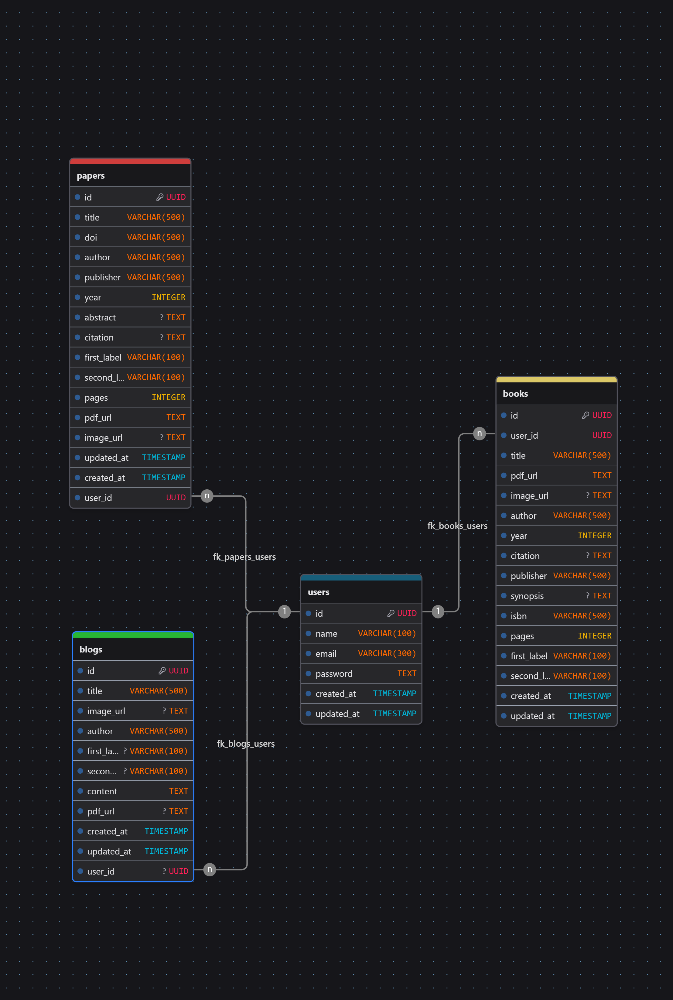

# Griya Waos Backend

<div align="center" width="700">
  
  
  
  
  
   <br />
  
  
  
</div> <br />

**Griya Waos Backend** is the backend RESTApi app build for Griya Waos full stack website project. Griya Waos itself is my personal project to sharpen my javascript Express and React skill.

This repository is licensed under MIT license.

## 🖥️ Tech Stack

1. **Framework**: ExpressJS version 5.
2. **Database**: PostgreSQL 17 using `NeonDB`.
3. **Deployment**: Vercel.
4. **Testing**: Bruno.
5. **Authentication**: JSON Web Token.

## 🛠️ Prerequisites

You need to install and configure some of this:

1. **NodeJS**: >20 versions.
2. **Git**: any versions.
3. **env**: Configure environtment variables [here](./.env.example).
4. **PostgreSQL**: versions 17. Or use third party like `NeonDB` or `Supabase`.
5. **pnpm**: Install with `npm install -g pnpm` (optional).

## 📅 Database Model

<div align="center">
  
</div>

## 🔗 API URL

**BASE URL** is : `/api/v1`

### Users Table (users)

1. **POST** `/login`: To login (needs username and password) <br />
2. **POST** `/register`: To register (needs username, password and email) <br />
3. Protected using JWT: <br />
   1. **PUT** `/papers/:id`: Update user.`You need to specify all user info` to ensure this information secured properly <br />
   2. **DELETE** `/papers/:id`: delete the user <br />

### Books Table (books)

**GET** `/books`: Get all books (can use page=&limit= params)<br />
**GET** `/books/:id`: Get book by id <br />
**POST** `/books`: Create book <br />
**PUT** `/books/:id`: Update book <br />
**DELETE** `/books/:id`: Delete a book <br />

Data: [Books Database](./src/test/mockBooks.json)<br />

### Papers Table (papers)

1. **GET** `/papers`: Get all papers (can use page=&limit= params) <br />
2. **GET** `/papers/:id`: Get paper by id <br />
3. Protected using JWT: <br />
   1. **POST** `/papers`: Create paper <br />
   2. **PUT** `/papers/:id`: Update paper <br />
   3. **DELETE** `/papers/:id`: delete paper <br />

Data: [Papers Database](./src/test/mockPapers.json)<br />

### Blogs Table (blogs)

1. **GET** `/blogs`: Get all blogs (can use page=&limit= params) <br />
2. **GET** `/blogs/:id`: Get blog by id <br />
3. Protected using JWT: <br />
   1. **POST** `/blogs`: Create blog <br />
   2. **PUT** `/blogs/:id`: Update blog <br />
   3. **DELETE** `/blogs/:id`: delete blog <br />

Data: [Blogs Database](./src/test/mockPapers.json)<br />

## ⚙️ Running instructions

1. Uncomment part of this [index.js](./src/index.js) (if I comment it):

```js
app.listen(port, () => {
  console.log(`Server is running on http://localhost:${port}`);
});
```

1. Install Dependencies:

```sh
# using npm
npm install

# using pnpm
pnpm install
```

2. Run the program:

```sh
# using npm
npm run dev

# using pnpm
pnpm dev
```

3. Your app should be running in `.env PORT` or http://localhost:3001
4. That's it. Try to query using bruno or postman.

## 💬 Contribution?

Sorry contribution is not available for now. I will block every pull request now until I complete all feature I need.
